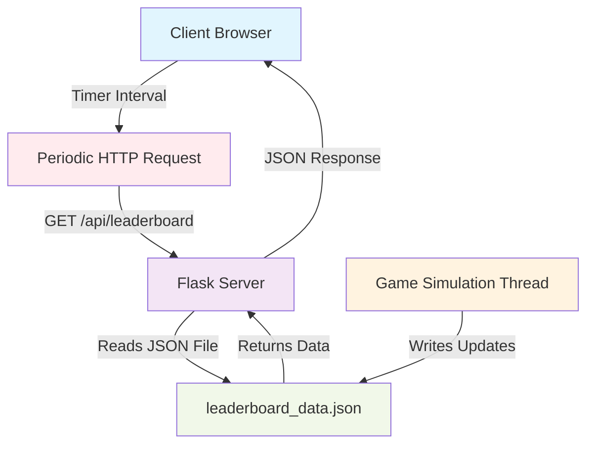

# 🎮 GamingLeaderboardAPIs

A real-time gaming leaderboard application that demonstrates and compares **Server-Sent Events (SSE)** vs **API Polling** approaches for live data updates. Built with Flask for educational purposes to understand different real-time communication patterns.


## 📋 Table of Contents

- [Overview](#-overview)
- [Architecture Comparison](#-architecture-comparison)
- [Features](#-features)
- [Technology Stack](#-technology-stack)
- [Installation](#-installation)
- [Usage](#-usage)
- [API Endpoints](#-api-endpoints)
- [Performance Analysis](#-performance-analysis)
- [Project Structure](#-project-structure)
- [Contributing](#-contributing)
- [License](#-license)

## 🎯 Overview

This project implements a real-time gaming leaderboard using two different approaches to demonstrate the advantages and trade-offs between Server-Sent Events and traditional API polling. Players' scores update dynamically, and the leaderboard reflects changes in real-time.

### Key Learning Objectives:
- Understanding **Server-Sent Events (SSE)** for real-time data streaming
- Comparing **API Polling** performance and resource usage
- Implementing thread-safe data updates in Flask
- Building responsive web interfaces with real-time updates

## 🏗️ Architecture Comparisons

### Server-Sent Events (SSE) Architecture

```mermaid
graph TB
    A[Client Browser] -->|Initial Request| B[Flask Server]
    B -->|HTML Response| A
    A -->|EventSource Connection| C[/leaderboard-updates]
    C -->|Persistent Connection| D[SSE Stream]
    E[Game Simulation Thread] -->|Updates Data| F[In-Memory Store]
    F -->|Triggers Event| D
    D -->|Real-time Data| A
    
    style A fill:#e1f5fe
    style B fill:#f3e5f5
    style D fill:#e8f5e8
    style E fill:#fff3e0
```

### API Polling Architecture



## ✨ Features

### Core Features
- **Real-time Score Updates**: Watch players climb the leaderboard live
- **Interactive UI**: Modern, responsive design with animations
- **Event History**: Track recent scoring events
- **Connection Status**: Visual indicators for connection health
- **Rank Animations**: Smooth transitions and highlighting effects

### Technical Features
- **Dual Implementation**: Both SSE and Polling versions
- **Thread-Safe Operations**: Concurrent data updates
- **Error Handling**: Robust connection management
- **Performance Monitoring**: Built-in status indicators
- **Scalable Design**: Modular architecture

## 💻 Technology Stack

### Backend
- **Flask 2.3.3**: Lightweight web framework
- **Python 3.9+**: Core programming language
- **Threading**: Concurrent gameplay simulation
- **JSON**: Data persistence and API responses

### Frontend
- **HTML5**: Modern semantic markup
- **CSS3**: Advanced styling with animations
- **JavaScript ES6**: Interactive functionality
- **Bootstrap 5**: Responsive UI framework
- **Font Awesome**: Icon library

### Development & Deployment
- **Docker**: Containerization
- **GitHub Actions**: CI/CD pipeline
- **pytest**: Testing framework
- **flake8**: Code linting

## 🚀 Installation

### Prerequisites
- Python 3.9 or higher
- pip (Python package installer)
- Git

### Local Development Setup

1. **Clone the repository**
```bash
git clone https://github.com/yourusername/GamingLeaderboardAPI.git
cd GamingLeaderboardAPI
```

2. **Create virtual environment**
```bash
python -m venv envGameLeaderSSE
source envGameLeaderSSE/bin/activate  # Linux/Mac
# or
envGameLeaderSSE\Scripts\activate     # Windows
```

3. **Install dependencies**
```bash
pip install -r requirements.txt
```

4. **Create templates directory structure**
```bash
mkdir -p templates
```

5. **Run the application**

**For Server-Sent Events version:**
```bash
python app.py
```

**For API Polling version:**
```bash
python appAPIPool.py
```

6. **Access the application**
- Open http://localhost:5000 in your browser

### Docker Setup

1. **Build the Docker image**
```bash
docker build -t gaming-leaderboard .
```

2. **Run the container**
```bash
# For SSE version
docker run -p 5000:5000 gaming-leaderboard python app.py

# For Polling version  
docker run -p 5000:5000 gaming-leaderboard python appAPIPool.py
```

## 🎮 Usage

### Running Both Versions

1. **Start the SSE version** on port 5000:
```bash
python app.py
```

2. **Start the Polling version** on port 5001:
```bash
flask --app appAPIPool run --port 5001
```

3. **Compare both versions** by opening:
   - SSE Version: http://localhost:5000
   - Polling Version: http://localhost:5001

### What to Observe

- **Real-time Updates**: Notice how both versions update the leaderboard
- **Network Traffic**: Use browser dev tools to compare network requests
- **Resource Usage**: Monitor CPU and memory consumption
- **Connection Behavior**: Observe how each handles network interruptions

## 📊 API Endpoints

### Common Endpoints

| Method | Endpoint | Description | Response |
|--------|----------|-------------|----------|
| GET | `/` | Main leaderboard page | HTML |
| GET | `/api/leaderboard` | Get current leaderboard data | JSON |

### SSE-Specific Endpoints

| Method | Endpoint | Description | Response |
|--------|----------|-------------|----------|
| GET | `/leaderboard-updates` | SSE stream for real-time updates | text/event-stream |

### API Response Format

```json
{
  "leaderboard": [
    {
      "id": 1,
      "name": "DragonSlayer",
      "score": 1250,
      "character": "🐉"
    }
  ],
  "events": [
    {
      "player_id": 1,
      "player_name": "DragonSlayer",
      "points": 50,
      "timestamp": "14:30:25",
      "message": "DragonSlayer scored 50 points!"
    }
  ]
}
```

## ⚡ Performance Analysis

### Server-Sent Events (SSE)

**Advantages:**
- ✅ **Low Latency**: Instant data delivery when events occur
- ✅ **Efficient**: Single persistent connection
- ✅ **Automatic Reconnection**: Built-in browser support
- ✅ **Server Push**: No unnecessary requests
- ✅ **Real-time**: True push-based communication

**Disadvantages:**
- ❌ **Resource Usage**: Maintains persistent connections
- ❌ **Scalability**: Limited concurrent connections
- ❌ **Complexity**: More complex error handling
- ❌ **Browser Limits**: Connection limits per domain

### API Polling

**Advantages:**
- ✅ **Simple Implementation**: Easy to understand and debug
- ✅ **Reliable**: Standard HTTP requests
- ✅ **Stateless**: No connection state to maintain
- ✅ **Cache-Friendly**: Responses can be cached
- ✅ **Scalable**: Standard web architecture

**Disadvantages:**
- ❌ **Higher Latency**: Delayed updates based on poll interval
- ❌ **Resource Waste**: Regular requests even when no updates
- ❌ **Network Overhead**: Multiple HTTP connections
- ❌ **Battery Impact**: Continuous polling on mobile devices

### Performance Metrics Comparison

| Metric | SSE | API Polling |
|--------|-----|-------------|
| **Latency** | ~50ms | ~1-2s (based on interval) |
| **Network Requests** | 1 persistent | 30 requests/minute (2s interval) |
| **Data Transfer** | ~2KB total | ~60KB/minute |
| **CPU Usage** | Low (event-driven) | Medium (timer-based) |
| **Memory Usage** | Medium (connection state) | Low |
| **Battery Impact** | Low | Medium-High |

## 📁 Project Structure

```
GamingLeaderboardAPI/
│
├── app.py                      # SSE implementation
├── appAPIPool.py              # API Polling implementation
├── requirements.txt           # Python dependencies
├── Dockerfile                 # Docker configuration
├── .gitignore                # Git ignore rules
├── README.md                 # Project documentation
│
├── .github/
│   └── workflows/
│       └── ci_cd_workflow.yml # CI/CD pipeline
│
├── templates/
│   ├── leaderboard.html       # SSE frontend
│   └── leaderboard_polling.html # Polling frontend
│
├── static/                    # Static assets (if any)
│
├── tests/                     # Unit tests
│   ├── __init__.py
│   ├── test_app.py           # SSE tests
│   └── test_polling.py       # Polling tests
│
└── data/                      # Data directory
    └── leaderboard_data.json  # Persistent storage
```

## 🔧 Configuration

### Environment Variables

Create a `.env` file for configuration:

```env
# Application Settings
FLASK_APP=app.py
FLASK_ENV=development
FLASK_DEBUG=True

# Server Settings
HOST=0.0.0.0
PORT=5000

# Game Settings
SIMULATION_MIN_DELAY=1
SIMULATION_MAX_DELAY=5
MAX_SCORE_INCREASE=100
MAX_EVENTS_HISTORY=10

# Polling Settings (for API version)
POLL_INTERVAL=2000
DATA_FILE=leaderboard_data.json
```

## 🎯 Key Concepts Explained

### What is API Polling?

API Polling is a technique where the client repeatedly requests data from the server at regular intervals to check for updates. It's a **pull-based** approach where the client initiates communication.

**How it works:**
1. Client makes HTTP request to server
2. Server processes request and returns current data
3. Client waits for a predetermined interval
4. Process repeats continuously

**Use Cases:**
- Dashboard updates
- Status monitoring
- Progress tracking
- News feeds

### What are Server-Sent Events (SSE)?

Server-Sent Events provide a way for a server to push data to a client in real-time over a single HTTP connection. It's a **push-based** approach where the server initiates data transmission.

**How it works:**
1. Client establishes EventSource connection
2. Server maintains persistent connection
3. Server pushes data when events occur
4. Client receives real-time updates

**Use Cases:**
- Live sports scores
- Stock price updates  
- Chat applications
- Real-time notifications

## 🧪 Testing

### Running Tests

```bash
# Install test dependencies
pip install pytest pytest-cov

# Run all tests
pytest

# Run with coverage
pytest --cov=. --cov-report=html

# Run specific test file
pytest tests/test_app.py -v
```

### Test Coverage

The test suite covers:
- API endpoint functionality
- Data persistence operations
- SSE connection handling
- Error scenarios
- Performance benchmarks

## 🚀 Deployment

### Using Docker

1. **Build and run locally:**
```bash
docker build -t gaming-leaderboard .
docker run -p 5000:5000 gaming-leaderboard
```

2. **Using Docker Compose:**
```yaml
version: '3.8'
services:
  leaderboard-sse:
    build: .
    ports:
      - "5000:5000"
    command: python app.py
    
  leaderboard-polling:
    build: .
    ports:
      - "5001:5000"
    command: python appAPIPool.py
```

### Production Considerations

- **Reverse Proxy**: Use nginx for SSL termination and load balancing
- **Process Management**: Use gunicorn or uWSGI for production WSGI server
- **Monitoring**: Implement health checks and monitoring
- **Scaling**: Consider horizontal scaling for high traffic
- **Security**: Implement rate limiting and input validation

## 🤝 Contributing

We welcome contributions! Please follow these steps:

1. **Fork the repository**
2. **Create a feature branch**
```bash
git checkout -b feature/amazing-feature
```
3. **Make your changes**
4. **Add tests** for new functionality
5. **Ensure tests pass**
```bash
pytest
```
6. **Commit your changes**
```bash
git commit -m "Add amazing feature"
```
7. **Push to branch**
```bash
git push origin feature/amazing-feature
```
8. **Open a Pull Request**

## Testing
#Pylint Test : pylint --disable=W,C,R app.py > errors.txt 

### Coding Standards
- Follow PEP 8 style guidelines
- Add docstrings to functions and classes
- Write tests for new features
- Update documentation as needed

## 📚 Educational Resources

### Related Concepts
- [WebSocket vs SSE vs Polling](https://example.com)
- [Real-time Web Applications](https://example.com)
- [Flask Threading and Concurrency](https://example.com)
- [HTTP/2 Server Push](https://example.com)

### Further Reading
- [MDN Server-Sent Events](https://developer.mozilla.org/en-US/docs/Web/API/Server-sent_events)
- [Flask Documentation](https://flask.palletsprojects.com/)
- [Real-time Web Architecture Patterns](https://example.com)

## 📄 License

This project is licensed under the MIT License - see the [LICENSE](LICENSE) file for details.

## 📧 Contact

- **Author**: Your Name
- **Email**: your.email@example.com
- **GitHub**: [@yourusername](https://github.com/yourusername)
- **LinkedIn**: [Your LinkedIn](https://linkedin.com/in/yourprofile)

---

⭐ **Star this repository** if you found it helpful for learning real-time web technologies!

## 🎉 Acknowledgments

- Flask community for excellent documentation
- Bootstrap team for responsive UI framework
- Contributors and reviewers
- Educational institutions promoting hands-on learning

---

*This project is designed for educational purposes to demonstrate different approaches to real-time web communication. Perfect for learning about modern web technologies and comparing architectural patterns.*